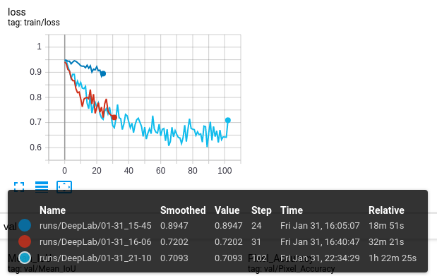
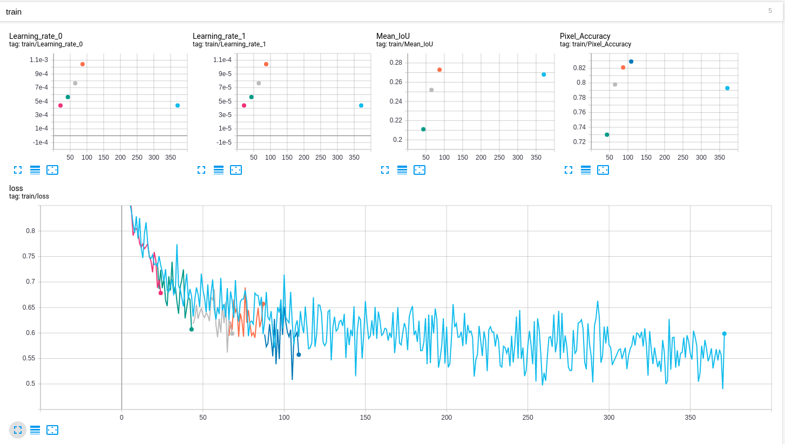
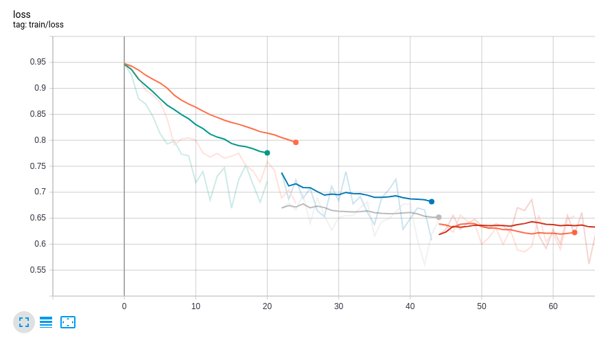

# 语义分割代码运行报告

## 概述

本报告包含本小组在一特定 Pytorch 实现的语义分割模型的训练步骤，其中包括实验经历，遇到的些微问题，与训练结果的部分展示。

由于机器配置低，运行时间紧，整个训练过程即使是在精简数据集下也只进行了一小部分，故除了关于 learning rate 的*简单*考量外，我们**没有也无法做出不同模型与超参好坏的比较**。即，本报告更应称为本小组的实验笔记，并为日后的机器学习实践积累经验。

## 实验材料与环境简介

### 代码简介

我们使用的代码来自 [Semantic Segmentation in Pytorch](https://github.com/yassouali/pytorch_segmentation)。选择的主要原因为，该代码支持大量的训练模型、数据集和损失函数等，并且配置简单；此外我们利用了代码内置的训练检查点重启等功能。

当然，本代码占用相当多的显存和内存。在下文与[后记](#后记)中可以见到本小组的体验历程。

### 使用的模型、数据集合与超级参数

在此代码诸多支持的模型中，我们选择了 DeepLab V3+：这也是我们前期做过论文阅读理解的模型。

数据集即为 Cityscapes：包含 gtCoarse，gtFine\_trainvaltest, leftImg8bit\_trainvaltest。下文提到，为了实验尽快执行，我们取了一个“精简数据集”：仅包括“完整数据集”的每一部分（train, val, test, train\_extra）的**第一个文件夹**里的数据。

Backbone 决定为 resnet101。

使用过的 Optimizer 包括 Adam。

损失函数使用过 Cross-Entorpy loss 和 Lovasz Softmax。

learning rate scheduler 使用过 Poly 和 OneCycle。

关于这些模型和方程的介绍，代码框架的 [github 仓库](https://github.com/yassouali/pytorch_segmentation)做了简单介绍。

本代码同时包含了data augmentation：旋转、随机 croping、随机 h-flip、blurring。在本小组的训练中，除了 blurring 以外都开启了。

### 运行时环境

- Ubuntu 19.10 x64, python 3.7.5
- Intel Core i7-8550U CPU @ 1.80GHz\*8, 16GiB RAM
- Nvidia MX150（训练时不可用）

## 实验过程

### 初始化

代码的 README 给出了一部分环境配置信息，包括：使用的 python 包，需要的 Cithscapes 数据与目录组织方式，以及如何利用 `config.json` 调整模型和超级参数等。但文档也存在相当多的不足。

关于使用的 python 包，代码作者给出的 `requirements.txt` 并没有给全，但也无伤大雅，诸如 sklearn 等只需在运行时依照 python3 的错误信息安装上就好。

代码作者给出了一个 `config.json` 的实例，但许多格式未作说明（给出的模型填作“PSPNet”，但当把模型换成 DeepLab V3+ 时应该填作什么并没有说明）。我们最后依据 traceback 信息翻找了代码的各个文件，阅读框架之后，将这个位置填上 “DeepLab”。我们之后做超参调整时，许多 config 信息（loss类型等）都是这样填进去的。有时不同的类型需要 config 里有不同的 args，在也要同理调整。

与此同时，对于不同的数据集，train\_loader，val\_loader 里也均有 args 需要调整，这些都是需要阅读代码才能找到的。

这里给出某一次训练中，我们使用的 `config.json`:

```json

{
    "name": "DeepLab", //changed from default
    "n_gpu": 1,
    "use_synch_bn": true,

    "arch": {
        "type": "DeepLab", //changed from default
        "args": {
            "backbone": "resnet", //changed from default
            "freeze_bn": false,
            "freeze_backbone": false
        }
    },

    "train_loader": {
        "type": "CityScapes", //changed from default
        "args":{
            "data_dir": "/home/thelitfire/Desktop/cityscape-dataset (copy)/", //changed from default
            "batch_size": 8,
            "base_size": 400,
            "crop_size": 380,
            "augment": true,
            "shuffle": true,
            "scale": true,
            "flip": true,
            "rotate": true,
            "blur": false,
            "split": "train", //changed from default
            "num_workers": 8
        }
    },

    "val_loader": {
        "type": "CityScapes", //changed from default
        "args":{
            "data_dir": "/home/thelitfire/Desktop/cityscape-dataset (copy)/", //changed from default
            "batch_size": 8,
            "crop_size": 480,
            "val": true,
            "split": "val", //changed from default
            "num_workers": 4
        }
    },

    "optimizer": {
        "type": "Adam", //changed from default
        "differential_lr": true,
        "args":{
            "lr": 0.01,
            "weight_decay": 1e-4
        }
    },

    "loss": "LovaszSoftmax", //changed from default
    "ignore_index": 255,
    "lr_scheduler": {
        "type": "Poly",
        "args": {}
    },

    "trainer": {
        "epochs": 80,
        "save_dir": "saved/",
        "save_period": 1, //changed from default
  
        "monitor": "max Mean_IoU",
        "early_stop": 1, //changed from default
        
        "tensorboard": true,
        "log_dir": "saved/runs",
        "log_per_iter": 1, //changed from default

        "val": true,
        "val_per_epochs": 1 //changed from default
    }
}

```

### 运行训练

#### 第一次测试

首次运行使用 CrossEntropyLoss2d，lr = 0.001，对*完整数据集*进行训练，一个 epoch 之后，在训练集上的像素准确度达到0.77，mIoU 达到0.39。但当开始第一个 epoch 后的验证时，由于内存不足而终止程序，没有得到更多结果。

#### 随后调整：精简数据集、逐 epoch 保存

面临内存不足，并试图解决训练过慢的问题时，我们的第一个想法是精简数据集。在精简数据集下，训练确实从数十小时减少为不到一小时，单个 epoch 后的验证 val 也可以正常进行，但仍不能连续训练两个 epoch。

代码作者给出的帮助信息里表示，程序包含了 “resume” 功能，可以在若干个 epoch 后保存 checkpoint，用于断点续传式的继续训练。我们将保存周期设为1个 epoch，并且设定每个 epoch 训练后都执行一次验证。

**在这中途，我们发现了代码实现 resume 时存在的一个问题，并添加代码将其修复了**：在 base\_trainer.py 第145行的后面应当在保存 checkpoint 时加上 'logger'。

修复后的 `_save_checkpoint`函数如下：

```Python
def _save_checkpoint(self, epoch, save_best=False):
        state = {
            'arch': type(self.model).__name__,
            'epoch': epoch,
            'state_dict': self.model.state_dict(),
            'optimizer': self.optimizer.state_dict(),
            'monitor_best': self.mnt_best,
            'config': self.config,
            'logger': self.train_logger
        }
        filename = os.path.join(self.checkpoint_dir, f'checkpoint-epoch{epoch}.pth')
        self.logger.info(f'\nSaving a checkpoint: {filename} ...') 
        torch.save(state, filename)

        if save_best:
            filename = os.path.join(self.checkpoint_dir, f'best_model.pth')
            torch.save(state, filename)
            self.logger.info("Saving current best: best_model.pth")
```

在原 github 仓库里我们也提出了 [issue](https://github.com/yassouali/pytorch_segmentation/issues/46)。

#### 继续训练：不同的学习率

接下来展示三次训练：这三次的损失函数改为 "LovaszSoftmax"，lr scheduler 从 "Poly" 变为 "OneCycle"，对完整数据集做一次完整或部分 epoch 训练。



浅蓝色线对应的训练与另外两条不同的是，其学习率初始设置为0.001，而其他两个（这两个的参数一致）初始学习率为0.01。显然，**更高的学习率获得了快速的损失下降**，但曲线趋向平缓也比较快：对几乎一半的训练时间，它的损失没有什么降低。

试图在每个 epoch 执行一半时停止它或许是不错的选择，但原始代码没有这样的功能，并且在这个“平缓的”过程中，像素精确度是有高达0.07的提高的。

与第一次实验相比，我们变换了损失函数（lr scheduler 的影响由于是单个epoch而忽略不计），最终单个 epoch 训练结束，浅蓝曲线对应的训练，**精确度较第一次实验提高了0.04**。这里我们并不打算断言 Softmax 比 SGD 要好，毕竟这只是一个 epoch。

#### 比较：更多的 epoch 还是更多的数据

接下来展示：在*“精简数据集”*上某次训练的*连续五个* epoch（暗红、绿、灰、橙、深蓝），在*“完整数据集”*上的*单独一个* epoch（浅蓝）



**在损失函数值曲线上，二者是趋同的。** 由于使用了 OneCycle lr scheduler，在图左上可以看到，浅蓝色的 learning rate 较低，而连续5个 epoch 的学习率不断递增（实际上，更多的epoch之后，学习率会呈现单峰）。**图右上显示了两种情况下的 mIoU 和 pixel accuracy，这两个指标，浅蓝色训练较差。**可能机器学习训练要迭代那么多次也不是没有道理。

#### 优化：lr scheduler 调参

在上一节的图中，连续的五个 epoch 所对应的学习率依次是：0.000441，0.000564，0.000765，0.001043，0.001392。学习率依次递增。而我们观察损失函数值的曲线时则发现， *现在应当是降低学习率的时候了* ！但是对 OneCycle lr scheduler 模型而言，接下来的几个epoch，学习率还会不断上升，这背离了我们的初衷。

试着使用 Poly lr scheduler 来替代它，并企图调整初始值和斜率来获得更好的效果？ Poly 的学习率会线性地降低，这似乎正是我们所需要的。

下图展示了六条损失函数曲线，每个横坐标区域靠上的三条正是前一节中在 Onecycle 下的三个连续 epoch，靠下的三条是在 Poly 下的三个连续 epoch（学习率依次为 0.001，0.00075，0.0005）。



**从损失函数值上可见，poly 的效果会更好。而与此同时，在 mIoU 和逐像素准确率上 poly 也更胜一筹。** 实际上，真正起到关键作用的是学习率的取法，如果一定要说，或许每次把学习率设为上个 epoch 的一半，效果可能更好。由于我们的代码只支持了 Poly 和 OneCycle 两种 lr scheduler，相较之下，Poly 更适合我们这个数据集场景。

### 实验后记

当执行前几次运行尝试后，我们发现了自己机器内存不足的问题，并试图通过诸多方式来解决，但最终由于时间紧迫而以不完美的结局告终。

我们的运行首先部署在 VMware 虚拟机上，后来发现 VMware Workstation pro 不支持 GPU 穿透，也不允许虚拟机用满物理计算机的内存（在小组某人的环境下，16GiB 的内存至多分配给虚拟机 13.6GiB）。

随后我们尝试直接将操作系统安装到物理机上，以试图充分使用内存并启用 GPU。实践表明，这样的环境下，训练可以逐个 epoch 地完成；但连续训练时，从第二个 epoch 开始不久便因内存不足而终止；甚至，在使用完整数据集时连续进行逐个 epoch 训练和验证也是不行的！

当我们试图启用电脑的 GPU 时，即使驱动正常，由于本小组计算机的显存普遍较小（2GiB），甚至无法满足训练的初步需求而导致程序终止。在本机环境的训练只得限制在 CPU 上。

最后的希望寄托在 Microsoft Azure 和 AWS 上，我们到最后仅仅成功地申请到了 AWS educate starter 账户（剩下的或者是不能完成海外银行卡验证，或者是取不到代金券），但我们能使用的计算资源受到限制。在这样的限制下，服务器配置还不如自己的笔记本电脑要好用！

最后，我们只好在自己的电脑上逐个 epoch 地手动依次训练与验证，并在有限的训练轮次中调整损失函数和训练率，获得了一些数据。
